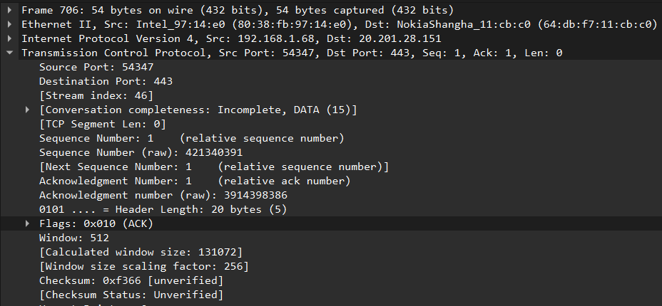

# Prática 04 - Handshake

## QUESTÃO 1

### TAREFA 1 - Detectar o endereço IP do seu host

**PASSO 1.** Use o comando **ipconfig** para descobrir seu endereço IP da conexão local ou conexão sem fio.

```
Adaptador de Rede sem Fio Wi-Fi:

   Sufixo DNS específico de conexão. . . . . . :
   Endereço IPv6 . . . . . . . . . . : 2804:880:1329:8900:c73a:4aa8:6339:1b5e
   Endereço IPv6 Temporário. . . . . . . . : 2804:880:1329:8900:e0d6:ae6a:71b9:a45
   Endereço IPv6 de link local . . . . . . . . : fe80::4fce:c39c:eddc:9423%19
   Endereço IPv4. . . . . . . .  . . . . . . . : 192.168.1.68
   Máscara de Sub-rede . . . . . . . . . . . . : 255.255.255.0
   Gateway Padrão. . . . . . . . . . . . . . . : fe80::1%19
                                                 192.168.1.254
```

### TAREFA 2 - Detectar o endereço IP do servidor de destino

**PASSO 1.** Escolha um site web para você abrir no navegador.

**PASSO 2.** Execute o comando **nslookup** para descobrir o endereço IP do servidor web. O servidor deve ter apenas um endereço IP.

```
Server:         10.255.255.254
Address:        10.255.255.254#53

Non-authoritative answer:
Name:   github.com
Address: 20.201.28.151
```

### TAREFA 3 - Usar o navegador web para se estabelecer conexão TCP

**PASSO 1** - Desabilite todas as interfaces de rede do seu host, exceto a interface de rede que possui o endereço IP registrado na Tarefa 1.

**PASSO 2** - Configure o Wireshark para capturar mensagens.

**PASSO 3** - No navegador web, abra o site escolhido.

**PASSO 4** - Pare o Wireshark e salve o trace da captura em um arquivo .pcap

### TAREFA 4 - Analisar as três mensagens de estabelecimento de conexão do TCP

**PASSO 1** - Na captura do Wireshark, filtre todas as mensagens que possui o IP do servidor web. Use o filtro ip.addr== ENDEREÇO_IP_DO_SERVIDOR_WEB

**PASSO 2** - Localize a mensagem HTTP Request solicitando o site que você escolheu. As mensagens de apresentação do TCP (Three-Way Handshake) se encontram antes desse HTTP Request.

**PASSO 3** - Capture a tela desses 3 pacotes expandidos no  Wireshark, mostrando todos campos de endereço IP Origem e Destino. Enfatize nessas capturas de tela as seguintes informações do TCP para cada um dos três segmentos: Source Port, Destination Port, Sequence Number e Acknowledgment Number.




**PASSO 4** - Preencha os campos abaixo usando as informações dos pacotes capturados.


| Primeiro Segmento TCP                            | Segundo Segmento TCP                             | Terceiro Segmento TCP                            |
|--------------------------------------------------|-------------------------------------------------|-------------------------------------------------|
| **Source port:** 54347 | **Source port:** 443 | **Source port:** 443 |
| **Destination port:** 443 | **Destination port:** 54347 | **Destination port:** 54347 |
| **Sequence Number:** 0 | **Sequence Number:** 0 | **Sequence Number:** 1 |
| **ACK Number:** 0 | **ACK Number:** 1 | **ACK Number:** 1 |
| **Marque com um X as flags que foram habilitadas:** | **Marque com um X as flags que foram habilitadas:** | **Marque com um X as flags que foram habilitadas:** |
| - [ ] ACK                                        | - [X] ACK                                        | - [X] ACK                                        |
| - [ ] Push                                       | - [ ] Push                                       | - [ ] Push                                       |
| - [X] Syn                                        | - [X] Syn                                        | - [ ] Syn                                        |
| - [ ] Fin                                        | - [ ] Fin                                        | - [ ] Fin                                        |

## QUESTÃO 2

1. Qual é o endereço IP e o número de porta TCP usado pelo computador cliente (origem) que está transferindo o arquivo para gaia.cs.umass.edu? 

**Resposta:** 192.168.1.69 e porta 55790

2. Qual é o endereço IP de gaia.cs.umass.edu? Em que número de porta está enviando e recebendo segmentos TCP para essa conexão?

**Resposta:** 128.119.245.12 e porta 80

3. Qual é o número de sequência do segmento TCP SYN que é usado para iniciar a conexão TCP entre o computador cliente e gaia.cs.umass.edu? Qual campo no cabeçalho do segmento identifica-o como um segmento SYN?

**Resposta:** Sequence number 0. Campo de flags com o bit SYN definido

4. Qual é o número de sequência do segmento SYNACK enviado por gaia.cs.umass.edu para o computador cliente em resposta ao SYN? Qual é o valor do campo Acknowledgment (reconhecimento) no segmento SYNACK? Como gaia.cs.umass.edu determinou esse valor? Qual campo no cabeçalho do segmento identifica-o como um segmento  SYNACK?

**Resposta:** Sequence number 0. Acknowledgment number 1. Campo de flags com os bits SYN e ACK definidos.

5. Qual é o número de sequência do segmento TCP que contém o comando HTTP POST? Observe que, para encontrar o comando POST, você precisará digitar no campo de conteúdo de pacote na parte inferior da janela Wireshark, procurando um segmento com um "POST" dentro de seu campo DATA.

**Resposta:** 151813

6. Considere o segmento TCP contendo o HTTP POST como o primeiro segmento na conexão TCP. Quais são os números de sequência dos primeiros seis segmentos na conexão TCP (incluindo o segmento que contém o HTTP POST)? Em que horário foi enviado cada segmento? Quando foi recebido o ACK para cada segmento? 

**Resposta:** Segments numbers: 1, 729, 2141, 3553, 4965, 6377. Time = 8.239334 para o primeiro e 8.239661 para o restante. Time = 8.346356.

7. Qual é o comprimento de cada um dos seis primeiros segmentos TCP?

**Resposta:** Len=728 para o primeiro e 1412 para os 5 seguintes.

8. Existem segmentos retransmitidos no ficheiro de rastreio? O que você verificou (no rastro) para responder a esta pergunta?

**Resposta:** Havia 3 segmentos retransmitidos durante o momento da captura, onde eram marcados por *[TCP Retransmission]* e o último que era TLSv1.3 por *[TCP Fast Retransmission]*

