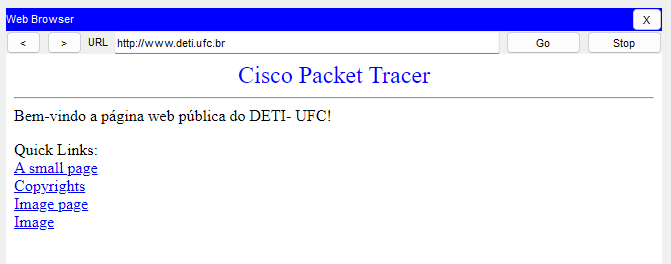

# LAB 06 - Trabalhando com a Camada de Aplicação: DHCP, DNS e HTTP

## 5. Descubra os endereços IP dos computadores de IP Dinâmicos/Automáticos

Saida ipconfig do Dinamico 1:
```
FastEthernet0 Connection:(default port)

   Connection-specific DNS Suffix..: 
   Link-local IPv6 Address.........: FE80::2E0:F7FF:FEC2:A664
   IPv6 Address....................: ::
   IPv4 Address....................: 172.16.0.100
   Subnet Mask.....................: 255.255.0.0
   Default Gateway.................: ::
                                     172.16.0.1
```

Saida ipconfig do Dinamico 2:
```
FastEthernet0 Connection:(default port)

   Connection-specific DNS Suffix..: 
   Link-local IPv6 Address.........: FE80::2D0:58FF:FE72:1744
   IPv6 Address....................: ::
   IPv4 Address....................: 172.16.0.102
   Subnet Mask.....................: 255.255.0.0
   Default Gateway.................: ::
                                     172.16.0.1
```

## 6. Verificando a conectividade da rede e configuração dos serviços

De um computador da topologia, use o ping para testar a conectividade com o servidor www.deti.ufc.br

```
Pinging 172.16.1.30 with 32 bytes of data:

Reply from 172.16.1.30: bytes=32 time<1ms TTL=128
Reply from 172.16.1.30: bytes=32 time<1ms TTL=128
Reply from 172.16.1.30: bytes=32 time<1ms TTL=128
Reply from 172.16.1.30: bytes=32 time<1ms TTL=128

Ping statistics for 172.16.1.30:
    Packets: Sent = 4, Received = 4, Lost = 0 (0% loss),
Approximate round trip times in milli-seconds:
    Minimum = 0ms, Maximum = 0ms, Average = 0ms
```

Use um navegador web de um computador da topologia para abrir a página de www.deti.ufc.br



## 9. Examine o tráfego HTTP quando um cliente se comunicar com o servidor.

c) Clique na aba Outbound PDU Details e vá para a seção do protocolo TCP. Registre o SRC PORT, DEST PORT, SEQUENCE NUM e o ACK NUM. O que está escrito à esquerda do campo Window?

SRC PORT: 1025; DEST PORT: 80

SEQUENCE NUM: 0; ACK NUM: 0

Ao lado do campo Window está o campo de Flags.

e) Clique neste envelope e selecione Outbound PDU Details. Que diferença há nos números de porta e de sequência?

SRC PORT: 80; DEST PORT: 1025

SEQUENCE NUM: 0; ACK NUM: 1

g) Quais informações estão contidas agora na seção TCP? Que diferença há entre os números de porta e de sequência do TCP SYN e TCPSYNACK?

SEQUENCE NUM agora é igual a 1. SRC PORT: 1025; DEST PORT: 80

## 10. Examine o tráfego DNS quando os clientes se comunicarem com o servidor.

c) Registre os valores SRC PORT e DEST PORT. Por que não há número de sequência e de reconhecimento?

SRC PORT: 1025 ; DEST PORT: 53

Porque diferente do TCP, o UDP não estabelece uma conexão antes de enviar dados e não precisa de uma confirmação de que o destinatário recebeu.

e) Clique no envelope dessa PDU e selecione Outbound PDU details. Que diferença há nos números de porta e de sequência da mensagem que o cliente enviou?

SRC PORT: 53 ; DEST PORT: 1025

Não tem número de sequencia (explicacão no item c acima)

f) O que contém na resposta DNS desta PDU que o cliente DNS deseja saber?

Em DNS Answer há o IP correspondente ao nome do dominio solicitado. (IP: 172.16.0.20, NAME: www.ufc.br)